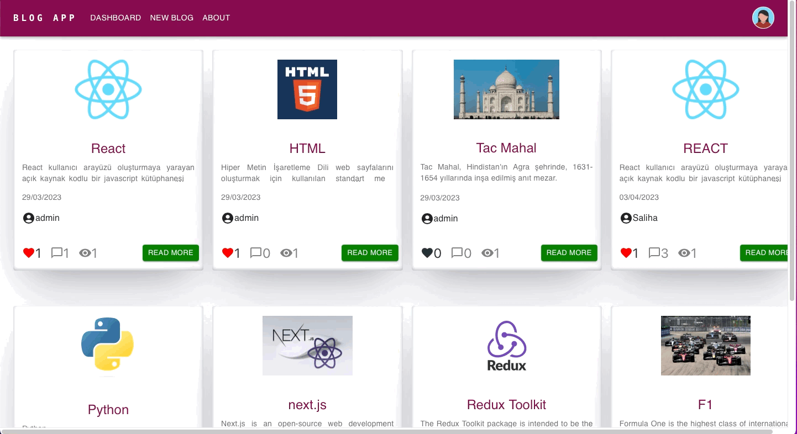

# Milestone Blog App

## Description

Project aims to create a Milestone Blog App.

## Problem Statement

- We are adding a new project to our portfolios. So you and your colleagues have started to work on the project.

## Project Skeleton

```
Milestone Blog App (folder for redux)

|----readme.md         
SOLUTION
├── src
|    ├── index.css
|    ├── index.js
|    ├── App.css
|    ├── App.js
|    ├── app
|    │   └── store.jsx
|    ├── assets
|    │   ├── about.png
|    ├── components
|    │   ├── auth
|    │   │   ├── LoginFom.jsx
|    │   │   └── RegisterForm.jsx
|    │   ├── blog
|    │   │   ├── Card.jsx
|    │   │   ├── CommentCard.jsx
|    │   │   ├── CommentForm.jsx
|    │   │   ├── DeleteModal.jsx
|    │   │   └── UpdateModal.jsx
|    │   ├── FooTer.jsx
|    │   ├── NavBar.jsx
|    ├── features
|    │   ├── authSlice.jsx
|    │   └── blogSlice.jsx
|    ├── helper
|    │   └── ToastNotify.jsx
|    ├── hooks
|    │   ├── useAuthCalls.jsx
|    │   ├── useAxios.jsx
|    │   └── useBlogCalls.jsx
|    ├── pages
|    │   ├── About.jsx
|    │   ├── Dashboard.jsx
|    │   ├── Detail.jsx
|    │   ├── Login.jsx
|    │   ├── NewBlog.jsx
|    │   ├── NotFound.jsx
|    │   ├── Profile.jsx
|    │   └── Register.jsx
|    └── router
|        ├── AppRouter.jsx
|        └── PrivateRouter.jsx
```

## Expected Outcome



## Objective

Build a Milestone Blog App using ReactJS.

### At the end of the project, following topics are to be covered;

- HTML

- CSS

- JS

- ReactJS

### At the end of the project, students will be able to;

- improve coding skills within HTML & CSS & JS & ReactJS & Django.

- use git commands (push, pull, commit, add etc.) and Github as Version Control System.

## Steps to Solution

- Step 1 : Create React App using `npx create-react-app react-django-blog-app`

- Step 2 : Use Django backend for authentication and CRUD operations.

- Step 3 : You can use css frameworks like Bootstrap, Tailwind Css, Material UI.

- Step 4 : You can view sample app on https://milestone-blogapps.vercel.app/.

- Step 5 : Add project gif to your project and README.md file.

## Notes

- You can add additional functionalities to your app.

**<p align="center">&#9786; Happy Coding &#9997;</p>**

## API
- Kendi linkinizi StockAppte olduğu gibi yine aynı adresten bu sefer Select application kısmında Blogapp Apıyi seçerek alabileceksiniz.
- Authentication işlemleri StockApp ile aynı sadece endpointler farklı:
```
  login => users/auth/login/
  register => users/register/
  logout => users/auth/logout/
```
- Post Read/List

```javascript
  endpoints => api/blogs/
  method: GET
  no authentication
  comments, post_view ve likes bilgileri response da dönüyor buradan alarak kullanabilirsiniz.
```

- Post Create

```javascript
  endpoints => api/blogs/
  method: POST
  headers: {"Authorization":`Token ${yourtoken}`}

  body: {
      "title": "string",
      "content": "string",
      "image": "http://example.com",
      "category": 0,// category endpointinden gelen verilerden seçmelisiniz
      "status": "d",// backende d olarak giderse ana ekranda gözükmez, My Blogs sayfasında gözükür. "d" valuesunu taslak gibi düşünebiliriz. Hazırladığınız selectboxlarda valua attiributelerine "d" ve "p" değerlerini girmelisiniz.
    }
    // yukarıdaki verileri göndermöeniz yeterli olacaktır
.
    category endpoints => "api/categories"
    status => {
      "d":"draft",
      "p":"published"
    }

```

- Post Update

```javascript
  endpoints => api/blogs/{post_id}/
  method: PUT
  headers: {"Authorization":`Token ${yourtoken}`}

  body: {
      "title": "string",
      "content": "string",
      "image": "http://example.com",
      "category": 0,
      "status": "d",
    }

    category endpoints => "api/categories"
    status => {
      "d":"draft",
      "p":"published"
    }
```

- Post Delete

```javascript
  endpoints => api/blogs/{post_id}/
  method: DELETE
  headers: {"Authorization":`Token ${yourtoken}`}
```

- Comments Create

```javascript
  endpoints => api/comments/{post_id}/
  method: POST
  headers: {"Authorization":`Token ${yourtoken}`}

  body:{
    "post":post_id,
    "content": ""
  }

```

- Likes Create

```javascript
  endpoints => api/likes/{post_id}/
  method: POST
  headers: {"Authorization":`Token ${yourtoken}`}
```

- Get Post Detail
```
  endpoints => api/blogs/${post.id}/
  method: GET
  headers: {"Authorization":`Token ${yourtoken}`}
```

- User Blogs
```
  endpoints => api/blogs/?author=${user.id}
  method: GET
  headers: {"Authorization":`Token ${yourtoken}`}
```

- Sample Get Response
```json
  {
        "id": 2,
        "title": "HTML",
        "content": "Hiper Metin İşaretleme Dili web sayfalarını oluşturmak için kullanılan standart metin işaretleme dilidir. Dilin son sürümü HTML5'tir. HTML, bir programlama dili olarak tanımlanamaz. Zira HTML kodlarıyla kendi başına çalışan bir program yazılamaz.",
        "image": "https://play-lh.googleusercontent.com/85WnuKkqDY4gf6tndeL4_Ng5vgRk7PTfmpI4vHMIosyq6XQ7ZGDXNtYG2s0b09kJMw",
        "category": 3,
        "publish_date": "2023-03-29T14:28:04.843506Z",
        "author": "admin",
        "status": "p",
        "slug": "",
        "comments": [
            {
                "id": 1,
                "user": "anthony",
                "time_stamp": "2023-03-29T20:19:17.298141Z",
                "content": "Hyper Text Markup Language",
                "post": 2
            },
            {
                "id": 2,
                "user": "anthony",
                "time_stamp": "2023-03-30T12:49:42.464555Z",
                "content": "merhaba",
                "post": 2
            }
        ],
        "category_name": "Web Development",
        "likes": 1,
        "post_views": 1,
        "comment_count": 2,
        "likes_n": [
            {
                "id": 4,
                "user_id": 2,
                "post_id": 2
            }
        ]
    }

```
